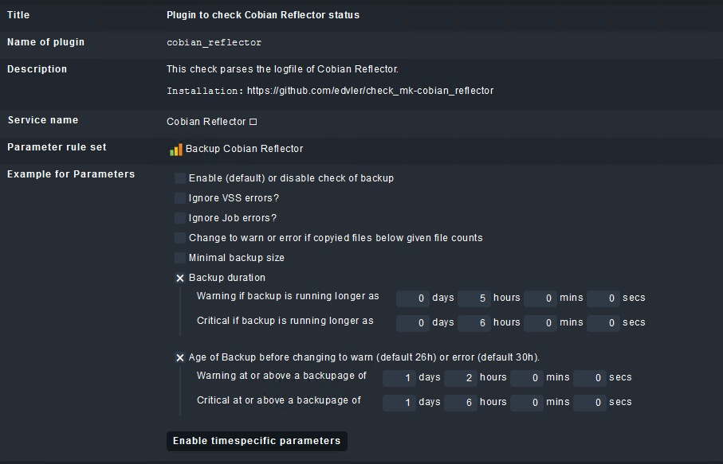
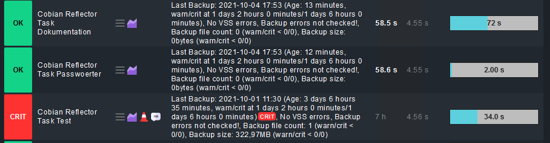

# [Check MK](https://mathias-kettner.de/check_mk.html) Plugin to check [Cobian Backup Tasks](https://www.cobiansoft.com/)

# Installation

## On the Monitoring Server where Check_mk is installed:
For a detailed description how to work with mkp's goto [https://mathias-kettner.de/cms_mkps.html](https://mathias-kettner.de/cms_mkps.html).

### Short tasks
1. copy the cobian_reflector*.mkp (see [dist](dist) folder) to your Check_mk server into the /tmp folder.
2. mkp install /tmp/cobian_reflector*.mkp (replace * with the current version)
3. Check if installation worked
```
root@monitoring01:/opt/omd# find . -name cobian_reflector
./sites/XXXX/var/check_mk/packages/cobian_reflector
./sites/XXXX/local/share/check_mk/checks/cobian_reflector
./sites/XXXX/local/share/check_mk/checkman/cobian_reflector
```

## On the Windows machine where Cobian Backup is installed:
1. Check if Powershell is installed
2. Copy the plugin script [check_mk/agents/plugins/cobian_reflector.ps1](check_mk/agents/plugins/cobian_reflector.ps1) into C:\Program Files (x86)\check_mk\plugins (old check_mk agent) or C:\ProgramData\checkmk\agent\plugins (new check_mk agent > v1.6.0p8)
5. Start PowerShell ISE and open the script. Click play to run it. The output should look as the following: 
```
PS C:\Users\mmaderer> C:\ProgramData\checkmk\agent\plugins\check_reflector.ps1
<<<cobian_reflector>>>
    2020-05-04 01:00 ** Backing up the task "backup_groups" **
    2020-05-04 01:00 The Volume Shadow Copy snapshot set has been created successfully
    2020-05-04 01:00 The Volume Shadow Copy snapshot set has been successfully deleted
    2020-05-04 01:00 ** Backup done for the task "backup_groups". Errors: 1. Processed files: 0. Backed up files: 0. Total size: 0 
bytes **
```

## Functions of the plugin


## Services screenshot

